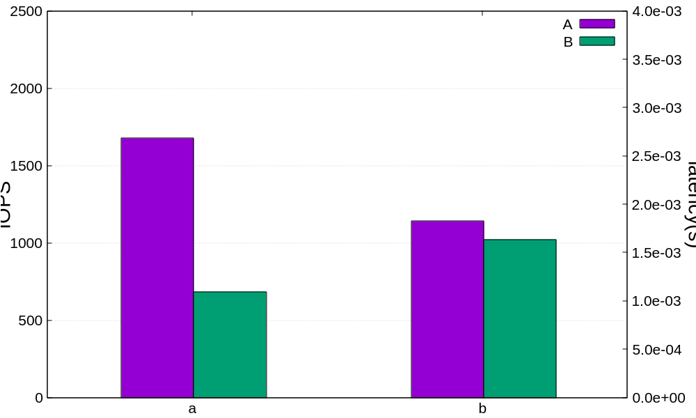
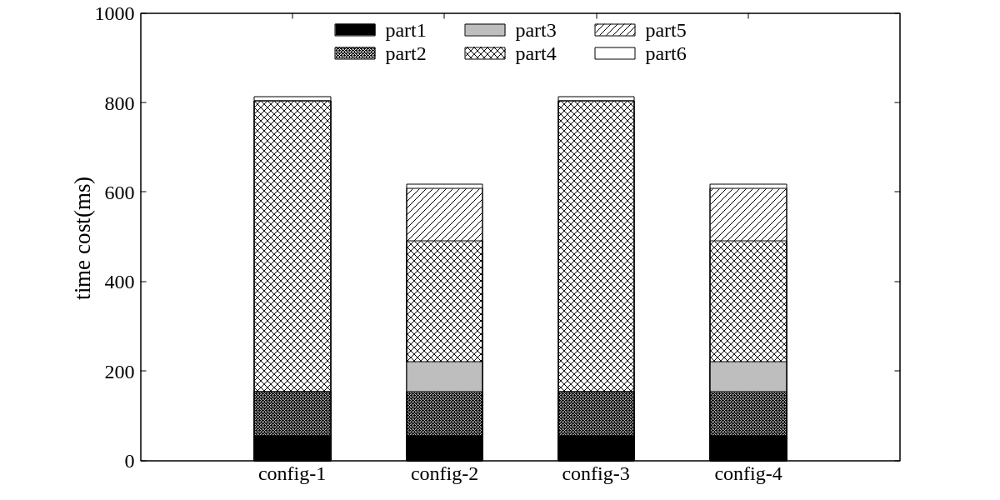
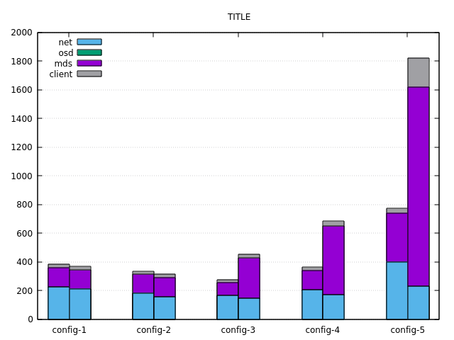
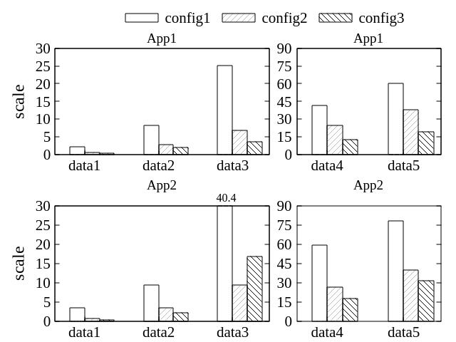
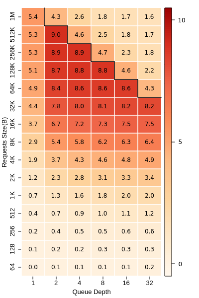

# Gnuplot Scripts

---

## Bar

### clustered

script(s):
* [clusted1](./bar/clustered1.gnu)
* [clusted2](./bar/clustered2.gnu)

### stacked

script(s):
* [stacked1](./bar/stacked1.gnu)
* [stacked2](./bar/stacked2.gnu)

### stacked & clustered

script(s):
* [stacked & clustered 1](./bar/stacked_clustered1.gnu)
* [stacked & clustered 2](./bar/stacked_clustered2.gnu)
* [stacked & clustered 3](./bar/stacked_clustered3.gnu)

### multiplot & clustered

script(s):
* [mutltiplot & clustered](./bar/multiplot_clustered.gnu)

## Heatmap

### 2D Heatmap of I/O Throughputs

script(s):
* [heatmap1](./heatmap/heatmap1.gnu)
* [heatmap2](./heatmap/heatmap2.gnu)
